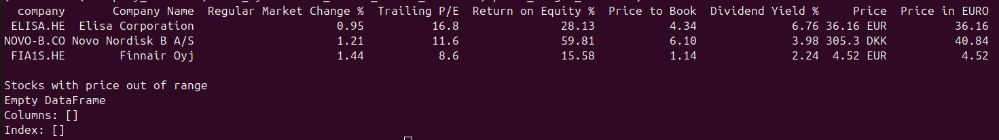

# investment-python

A library along with CLI (currently only working in Linux) for pulling stock market quotes and fundamentals (price,
P/E, ROE, P/B, dividend yield, and more) for a watch list of companies given
as ticker symbols or a CSV file. It can sort the results, flag stocks trading
outside a given price range, and export everything to CSV.

## Requirements

- Python 3.13+
- [`uv`](https://docs.astral.sh/uv/) for dependency management and running the tool

Install dependencies with:

```
uv sync
```

Then run the tool with `uv run investment ...`.

## CLI Usage
### Fetch Metrics

```
uv run investment metrics METRIC_NAMES (--company-symbols SYMBOLS | --company-csv PATH_OR_URL) [options]
```

- `METRIC_NAMES` — required, positional. One or more metrics delimited by
  comma, e.g. `PRICE,TRAILING_PE`. Choose from: `COMPANY_NAME`, `PRICE`,
  `PRICE_IN_EURO`, `MARKET_STATE`, `TRAILING_PE`, `DIVIDEND_YIELD`,
  `DIVIDEND_PAYOUT_RATIO`, `RETURN_ON_EQUITY`, `REGULAR_MARKET_CHANGE_PERCENT`,
  `PRICE_TO_BOOK`.
- `--company-symbols` — company ticker symbols as used on *Yahoo Finance*,
  delimited by comma, e.g. `AAPL,ELISA.HE`. Mutually exclusive with
  `--company-csv`; one of the two is required.
- `--company-csv` — path or URL to a CSV file with a `Yahoo Company Symbol`
  column.
- `--sort-by` — optional. Sort results ascending by this metric; must be one
  of the metrics given in `METRIC_NAMES`.
- `--price-ranges` — optional. Flag companies whose price falls outside a
  range, formatted as `COMPANY_ID1:MIN:MAX,COMPANY_ID2:MIN:`, e.g.
  `AAPL:150:200,ELISA.HE:30:`. Leave `MIN` or `MAX` empty for no lower/upper
  bound.
- `--output-csv-name` — optional. Also write the metrics result to this CSV
  file. When given, any companies that failed to fetch are additionally
  written to `companies_with_error.csv`, and any companies outside their
  price range (per `--price-ranges`) are written to `alert_on_companies.csv`.

#### Example Command

```
uv run investment metrics COMPANY_NAME,PRICE,REGULAR_MARKET_CHANGE_PERCENT,PRICE_IN_EURO,TRAILING_PE,RETURN_ON_EQUITY,PRICE_TO_BOOK,DIVIDEND_YIELD --sort-by REGULAR_MARKET_CHANGE_PERCENT --company-symbols ELISA.HE,FIA1S.HE,NOVO-B.CO
```



### Benchmarking

Compare a stock's price performance against a benchmark (an index or another
stock) over a given period: both series are rebased to an index of 100 at the
start date, and a beta coefficient (`Cov(stock, benchmark) / Var(benchmark)`,
from daily returns) is printed.

```
uv run investment benchmark BENCHMARK_ID:COMPANY_ID --start-date START_DATE --end-date END_DATE [--graph-directory DIRECTORY]
```

- `BENCHMARK_ID:COMPANY_ID` — required, positional. The benchmark and company
  ticker symbols, delimited by a colon, e.g. `VOO:T`.
- `--start-date` — required. Start date of the period, in ISO format, e.g.
  `2021-08-30`.
- `--end-date` — required. End date of the period, in ISO format, e.g.
  `2026-08-30`.
- `--graph-directory` — optional. Save the chart as a PNG named
  `COMPANY_ID_vs_BENCHMARK_ID.png` in this directory. If omitted, the chart is
  not saved.

The chart is always displayed in a window (this blocks until the window is
closed).

#### Example Command

```
uv run investment benchmark VOO:T --start-date 2021-08-30 --end-date 2026-08-30 --graph-directory ./charts
```
